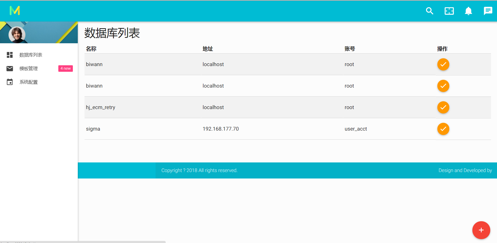
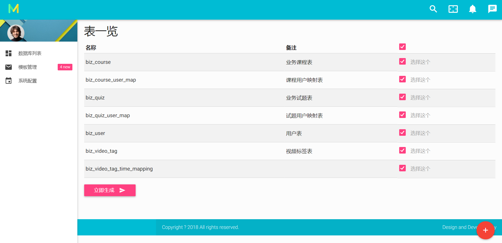
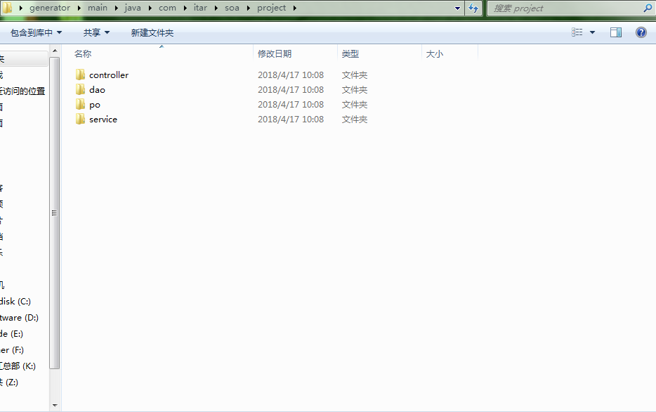

# 自动代码生成工具  

### 1、用处
一键生成Mybatis Mapper文件、Dao文件，Service ， Controller层增删改查代码
### 2、介绍
本工具基于模板配置而成，可自定义模板，可以生成自己的Controller/Service/Dao/XML文件，比如您想要在类中自定义一些注解，修改模板即可
### 3、展示
数据库列表如下图所示：



读取到的表如下：



生成的代码如下：



Mapper文件生成教完善  


```java

```

